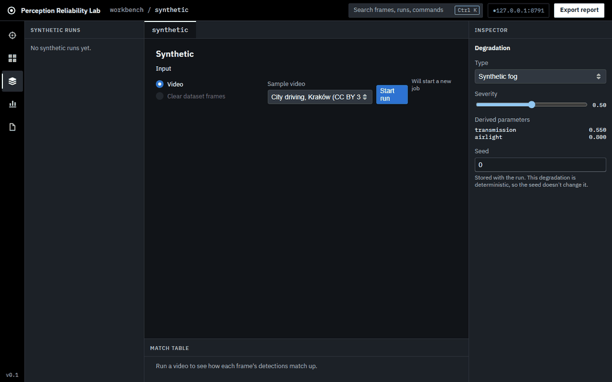
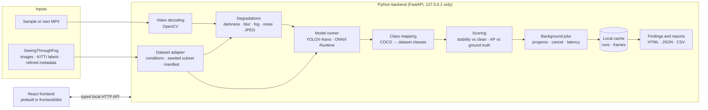

# Edge Perception Reliability Lab



*Synthetic mode on the bundled Kraków clip, on CPU from a fresh clone. Benchmark mode isn't shown, because its screens display dataset frames, and no dataset images appear anywhere in this repository.*

A pretrained object detector that works on a sunny demo clip says little about whether it still works at night, in fog or in snow. This project is a local workbench for finding out. It runs a small detector (YOLOX-Nano) on real adverse-weather driving frames from SeeingThroughFog and scores it against human labels, condition by condition. It applies controlled synthetic degradations (darkness, blur, fog, noise, JPEG) to clean input and measures how the detections change. Then it puts the two side by side, to ask whether simulated fog damages the detector the way real fog does. It is an engineering evaluation that shows its sample sizes and limitations, not a safety claim. The full specification is in [`docs/edge-perception-reliability-lab-spec.md`](docs/edge-perception-reliability-lab-spec.md).

## Headline finding

> **Placeholder: no headline yet.** The first real sim-to-real comparison has been run, but its result needs investigating before it can be stated: on that subset, real fog appears to *raise* overall mAP, which isn't physically plausible. See [#57](https://github.com/Khriis-K/Edge-Perception-Reality-Lab/issues/57) for the numbers and what is being checked. This section will hold the finding once it is understood. No number here is estimated.

## Quick start: the synthetic demo on CPU

Python 3.12+ only. No Node.js, no GPU, no dataset. The built frontend ships in `frontend/dist`.

```
py -m venv .venv
.venv/Scripts/pip.exe install -e ".[cpu]" -c constraints.txt
.venv/Scripts/python.exe scripts/fetch_model.py
```

Then the one command that starts the app:

```
.venv/Scripts/python.exe -m backend
```

Open http://127.0.0.1:8000. The app binds to 127.0.0.1 only. Use `--port` to change the port. On macOS/Linux, use `python3 -m venv .venv`, `.venv/bin/pip` and `.venv/bin/python`.

`fetch_model.py` downloads the YOLOX-Nano weights (Apache-2.0, pretrained on COCO) into `models/` and checks their SHA-256. Without them the app still starts, but refuses runs and says how to fetch them. `--runner stub` swaps in a deterministic stand-in detector, which the browser tests use.

Two sample videos are bundled:

- **City driving, Kraków** (the default): 20 seconds of real dashcam footage with cars and pedestrians (see [Credits](#credits)).
- **Synthetic traffic**: a bright block driving across a dark road. It is the test fixture. The stub "detects" it; the real detector finds nothing, because it isn't a real scene.

**NVIDIA GPU:** install `".[gpu]"` instead of `".[cpu]"`. The detector then runs on CUDA, and the Latency panel shows `CUDAExecutionProvider`. Choose one: both builds install the same `onnxruntime` package. To switch an existing venv, first run `pip uninstall -y onnxruntime onnxruntime-gpu`.

### Pinned versions

Direct dependencies are pinned exactly in [`pyproject.toml`](pyproject.toml), and [`constraints.txt`](constraints.txt) pins every package a CPU install with the dev tools resolves to, frozen from a clean Python 3.13 venv. Packages the GPU build adds (the NVIDIA runtime libraries) aren't in it. The frontend's packages are pinned by `frontend/package-lock.json`. Tested with Python 3.13 and 3.14, and Node.js 20+ for frontend work.

## Benchmark mode: connect SeeingThroughFog (optional)

Synthetic mode works without it. Benchmark mode needs a local copy of SeeingThroughFog (Bijelic et al., CVPR 2020). Download it from its official source ([repository and download page](https://github.com/princeton-computational-imaging/SeeingThroughFog)). Registration is required, and the dataset's own terms of use apply. Keep it outside this repo; it is never bundled, mirrored or redistributed here.

1. **Download only the three parts the app reads.** Skip everything else: lidar, radar, gated, thermal, raw camera, road friction and weather station. Each part is its own archive. The camera images are split into `cam_stereo_left_lut/cam_stereo_left_lut.z01`…`.z23` plus `cam_stereo_left_lut.zip`. The labels and metadata are single zips: `gt_labels/cam_left_labels_TMP.zip` and `labeltool_labels/labeltool_labels_refined.zip`.

2. **Check the download.** Upstream publishes no checksums for these per-folder archives: their `SeeingThroughFog_sha256sum.txt` covers a combined archive the download doesn't contain. Zip stores a CRC32 for every file, so a corrupt download fails at extraction instead:

   - Make sure every split part, `.z01`…`.zNN`, sits next to its `.zip`. A missing part stops extraction partway.
   - Extraction must finish with no CRC errors. If 7-Zip reports one, download that archive again.

3. **Extract in two stages.** First list each archive with `7z l ARCHIVE.zip` to see where its contents land. Then extract it with `7z x ARCHIVE.zip -oDEST`, for example `7z x cam_stereo_left_lut/cam_stereo_left_lut.zip -oD:/data/SeeingThroughFog`. 7-Zip reads the `.z01`…`.zNN` parts automatically. Pick `DEST` so the folders end up at these paths under one dataset root:

   | Part | Folder |
   | --- | --- |
   | 8-bit tone-mapped left camera images | `cam_stereo_left_lut` |
   | Ground-truth labels (KITTI format) | `gt_labels/cam_left_labels_TMP` |
   | Refined environment metadata (fog, precipitation, daytime) | `labeltool_labels_refined` |

   The original `labeltool_labels` isn't needed; the app reads the refined metadata.

4. **Start the app with the dataset folder.** It is set only at startup, never from the browser:

   ```
   .venv/Scripts/python.exe -m backend --dataset D:/data/SeeingThroughFog
   ```

   Or set `EDGE_LAB_DATASET`; the flag wins if both are set. Setup shows each part as present or missing, and names any part it can't find. Use Re-check after extracting more.

### Reproduce the benchmark from the committed manifest

[`benchmark/subset-manifest-seed0-cap300.json`](benchmark/subset-manifest-seed0-cap300.json) is the subset of the project's real Benchmark run. It holds the seed (0), the cap (300 frames per condition), the condition vocabulary version and the frame ids, never images. To rerun it:

1. Start the app with `--dataset` as above.
2. Open **Benchmark**, choose **Run a saved manifest**, and pick that file.

The app refuses a manifest from another condition vocabulary, or one listing frames your copy of the dataset doesn't have. Drawing seed 0 with cap 300 in Setup gives the same subset. **Download manifest** in Setup saves any other subset the same way, ready to commit.

The first time Setup's Subset table loads, the app reads every label and metadata file. That can take a few minutes on the full dataset; after that it is cached until the app restarts.

## Architecture



The frontend draws overlays and charts from the API's structured data. It runs no inference, matching or metrics, and loads no third-party scripts, fonts or analytics. The model runner is a small interface, so the detector can be swapped without touching the dashboard. Frame images are served only from the cache and the configured dataset folder, by id; the API never accepts a file path from the browser.

## Metrics

Two families of metrics, and they are never mixed up.

**Stability** (Synthetic mode on video). The clip has no labels, so the clean frame's detections are the baseline, and these numbers only say how much the degraded detections differ from them. They are never called accuracy, precision, recall or mAP. Per frame, on detections at confidence ≥ 0.25, matched greedily by IoU ≥ 0.5:

- **retained**: same class on both sides;
- **class change**: overlapping, but a different class;
- **dropped**: a clean detection with no match;
- **introduced**: a degraded detection with no match.

The clip reports the retention rate, the introduced rate, the class-change count and the median confidence shift of matched detections.

**Accuracy** (Benchmark mode, and Synthetic mode on dataset frames). Detections are scored against the human labels, per frame, taking predictions in descending confidence:

1. **Hit**: a prediction takes the unmatched object of its own class it overlaps most, at IoU ≥ 0.5.
2. **Class confusion**: a leftover prediction takes an unmatched object of another class, the same way.
3. **Ignored**: a leftover prediction with at least half its area inside an ignore region.
4. **False alarm**: any other prediction. Objects still unmatched are **misses**.

AP per class is the area under the interpolated precision-recall curve over all points, with tied confidences forming one point. mAP is the mean over the classes that have objects. Precision and recall are also shown at the display threshold you choose. Detections are kept down to a confidence floor of 0.05, so changing the threshold or drawing curves never re-runs inference. On dataset frames, Synthetic mode reports both stability and accuracy.

**Sample sizes.** Every metric shows its object and frame counts, and is flagged **low n** below 30 objects. A condition is low n when any class in its mAP is, or when it has no objects at all. On video, objects are counted as detections across frames, and consecutive frames of one object aren't independent evidence, so there the flag under-warns ([ADR 0001](docs/adr/0001-count-detections-not-objects-on-video.md)).

**Worst frames.** Each frame gets a score, and the app shows every contributing value next to it:

| Mode | Score |
| --- | --- |
| Benchmark | misses × 1 + false alarms × 1 + class confusions × 1 |
| Synthetic | dropped × 1 + introduced × 1 + class changes × 1 + confidence loss × 1 |

Confidence loss is the total confidence that matched detections lost (gains count as 0), so losing a full 1.0 of confidence weighs as much as one dropped detection.

**Sim-to-real.** For each class, the AP drop from clear · day to synthetic fog on those same clear frames is shown beside the drop from clear · day to real fog · day. The real-fog frames are different scenes, so this comparison is distributional, not paired.

## Class mapping and ignore regions

| Detector (COCO) | Dataset class |
| --- | --- |
| car | PassengerCar |
| truck, bus | LargeVehicle |
| bicycle, motorcycle | RidableVehicle |
| person | Pedestrian |

Every other COCO class is left out of benchmark metrics, but stays in the raw detections.

**Ignore-region rule.** The fallback labels Vehicle and Obstacle (the annotator couldn't tell the type), DontCare, and every `*_is_group` crowd box are ignore regions. They count as neither hits nor misses, and a prediction with at least half its area inside one isn't a false alarm. Any other label is dropped like an unmapped class. Pedestrian is generic category detection only. The full definition is in [`backend/class_mapping.py`](backend/class_mapping.py), and every exported report includes it.

## Condition mapping

Each sample gets one of eight conditions (clear, fog, snow and rain, each split into day and night) from SeeingThroughFog's refined metadata (vocabulary version 1):

| Refined metadata | Condition |
| --- | --- |
| `fog.no` and `precipitation.no` | clear |
| `fog.yes.denseFog` or `fog.yes.lightFog`, no precipitation | fog |
| `precipitation.yes.snow.heavySnow` or `.lightSnow`, no fog | snow |
| `precipitation.yes.rain`, no fog | rain |
| `daytime.day` / `daytime.night` | -day / -night split |

These samples are excluded and counted, never guessed:

- fog with rain or snow (in the real data always fog with snow, 53% of fog samples);
- twilight;
- rain with snow;
- day or night unclear;
- contradicting flags;
- incomplete metadata;
- a malformed label line.

Because of this, the fog condition is about 81% dense fog. The reasoning and the counts are in [`backend/conditions.py`](backend/conditions.py) and [`docs/research/seeingthroughfog-data-inspection.md`](docs/research/seeingthroughfog-data-inspection.md).

Setup's Subset table draws up to a cap of frames per condition (default 300) with a seed (default 0). The same seed, cap and dataset always give the same subset.

## How timing is measured

Every frame is timed with `time.perf_counter`, stage by stage:

- **read**: decoding a video frame, or reading a dataset image;
- **degrade**: applying the degradation;
- **inference**: the ONNX Runtime `session.run` call alone;
- **processing**: letterboxing before inference, and decoding plus NMS after it;
- **render**: encoding frames into the cache.

A Benchmark run reads dataset images and degrades and renders nothing, so it has no degrade or render stage (shown as none, never 0 ms). The first 2 frames are warm-up and are left out of every stage, because a fresh session allocates memory and picks kernels on its first calls. Each stage reports p50 and p90. Effective fps is 1000 / (read p50 + processing p50 + inference p50); degrading and rendering are left out, because a deployed detector wouldn't do them. The execution provider is recorded with every run. The numbers are this machine's timing only, not a real-time claim for other hardware. Full method: [`backend/latency.py`](backend/latency.py).

## Local files and removing cached artifacts

- `models/` holds the fetched weights.
- `cache/` holds finished runs: the results, plus the clean and degraded frames of video runs. Runs on dataset frames store no images.
- `exports/` holds exported reports.

All three are local only and ignored by git.

A run is cached under an id built from everything that affects its results: the input video's content (or, for Benchmark runs, the subset manifest), the model version, the class-mapping version, the confidence floor, and the degradation type, severity and seed. Starting a run with the same settings reuses the cached results, including after a restart. A Benchmark run stores detections and each frame's ground truth, never dataset images. A cancelled or failed run is never cached. The dataset's files aren't fingerprinted, so delete `cache/` if you change the dataset itself ([ADR 0002](docs/adr/0002-what-the-experiment-id-covers.md)).

**To remove cached artifacts**, delete `cache/`, or one run's folder inside it, whenever you like. A run in progress at that moment fails and can be started again. Setup shows the cache folder and its size. `--cache-dir <folder>` and `--exports-dir <folder>` keep them elsewhere.

## Limitations

- **Dataset, subset, model and mapping only.** Results hold for this SeeingThroughFog subset, YOLOX-Nano and this class mapping, and say nothing beyond them.
- **Weather isn't the only thing that changes.** Weather co-occurs with lighting, road type and traffic, so a drop under "fog" mixes fog with everything else that differs in those drives.
- **Sim-to-real is distributional.** Real-fog frames are different scenes from the clear frames, so the comparison is between distributions, not paired frames. A mismatch is a finding about the simulation, not a failure of the evaluation.
- **Small samples are noisy.** Metrics under 30 objects are flagged low n. On video, the flag under-warns.
- **Latency is this machine only.** It is CPU (or GPU) timing on the machine that ran it, with the provider recorded, not a real-time claim.
- **Not validated for safety-critical or operational use.** This is an educational robustness evaluation. Its outputs are model outputs, not facts, and it draws no automated conclusions.

## Ethical-use boundaries

- The detector finds generic categories only (cars, large vehicles, ridable vehicles, pedestrians). There is no person identification, facial recognition, biometric or attribute analysis, weapon classification, targeting or engagement functionality, and none should be added.
- It is not for live surveillance, drone or vehicle control, or integration with physical sensors.
- It does not generate adversarial examples to evade perception systems.
- All processing stays on your machine. There is no telemetry, cloud inference or upload. The server is reachable from this machine only.
- Dataset imagery is never redistributed. Reports leave dataset frames out by default and refer to them by id. The README and repository publish charts and aggregate metrics only.

## Develop

Changing the frontend needs Node.js 20+:

```
.venv/Scripts/pip.exe install -e ".[cpu,dev]" -c constraints.txt
npm --prefix frontend ci
```

Frontend with hot reload, in two terminals:

```
.venv/Scripts/python.exe -m backend --dev   # allows cross-origin calls from the Vite dev server
npm --prefix frontend run dev               # http://127.0.0.1:5173
```

`--dev` is the only mode that enables CORS, and only for the Vite dev server's origin.

**The built frontend is committed.** After changing anything under `frontend/src` (or the frontend's dependencies or build config), run `npm --prefix frontend run build` and commit `frontend/dist`. The build needs the project's `.venv` as well as Node.js. The build stamps `dist` with a digest of its sources, and `pytest` fails if they no longer match, so a stale bundle can't be committed unnoticed.

The frontend's API types are generated from the backend's OpenAPI schema. After changing a Pydantic model:

```
npm --prefix frontend run gen:api
```

## Test

```
.venv/Scripts/python.exe -m pytest                    # backend contract tests, and the bundle is current
.venv/Scripts/python.exe -m pytest -m model           # runner contract and max-severity darkness/fog, on the real weights
npm --prefix frontend exec -- playwright install chromium   # once
npm --prefix frontend run check                       # API types are current, unit tests, then browser + axe tests
```

The synthetic sample video is also the test fixture. To regenerate it:

```
.venv/Scripts/python.exe scripts/make_sample_video.py
```

Tests never use the real dataset. They generate a small stand-in with `scripts/make_fixture_dataset.py` (the e2e run writes it to `frontend/.e2e-dataset/`).

## Citation

The real-weather benchmark uses the SeeingThroughFog dataset:

> Mario Bijelic, Tobias Gruber, Fahim Mannan, Florian Kraus, Werner Ritter, Klaus Dietmayer and Felix Heide. "Seeing Through Fog Without Seeing Fog: Deep Multimodal Sensor Fusion in Unseen Adverse Weather." *IEEE/CVF Conference on Computer Vision and Pattern Recognition (CVPR)*, 2020.

```bibtex
@InProceedings{Bijelic_2020_STF,
    author={Bijelic, Mario and Gruber, Tobias and Mannan, Fahim and Kraus, Florian and Ritter, Werner and Dietmayer, Klaus and Heide, Felix},
    title={Seeing Through Fog Without Seeing Fog:
    Deep Multimodal Sensor Fusion in Unseen Adverse Weather},
    booktitle = {The IEEE Conference on Computer Vision and Pattern Recognition (CVPR)},
    month = {June},
    year = {2020}
}
```

## Credits

The bundled sample `samples/krakow_city_driving.mp4` is a 20-second excerpt of "City Driving 4K- Kraków Poland 2024" by **Relaxing Roads 4K**, licensed under [CC BY 3.0](https://creativecommons.org/licenses/by/3.0/). Source: [Wikimedia Commons](https://commons.wikimedia.org/wiki/File:City_Driving_4K-_Krak%C3%B3w_Poland_2024.webm), originally published on YouTube. It was cut to 7:30–7:50, resized to 960×540, reduced from 60 to 15 fps, and re-encoded as MPEG-4. The full credit ships with the clip in [`samples/CREDITS.md`](samples/CREDITS.md).

`samples/synthetic_traffic.mp4` is generated by this project (`scripts/make_sample_video.py`).

The detector is [YOLOX](https://github.com/Megvii-BaseDetection/YOLOX)-Nano by Megvii, under Apache-2.0, pretrained on COCO.
